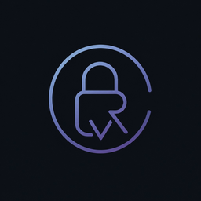

<![CDATA[<p align="center">
  
</p>

<h1 align="center">Orvpass</h1>

<p align="center">
  <strong>Your secrets belong to you.</strong><br/>
  A lightning-fast, military-grade, open-source password manager.<br/>
  Built with Rust · Tauri · React
</p>

<p align="center">
  <a href="https://github.com/krtvysinghh/Orvpass/releases/latest"></a>
  <a href="LICENSE"></a>
  <a href="https://github.com/krtvysinghh/Orvpass/actions"></a>
  <a href="https://github.com/krtvysinghh/Orvpass/releases"></a>
</p>

---

## Install

**macOS**
```
brew install --cask orvpass
```

**Windows**
```
winget install krtvysinghh.Orvpass
```

**Direct Download** — grab the latest from [Releases](https://github.com/krtvysinghh/Orvpass/releases/latest):

| Platform | Files |
|----------|-------|
| macOS | `.dmg` (Apple Silicon) |
| Windows | `.exe` `.msi` (x64) |
| Linux | `.deb` `.rpm` `.AppImage` (x64) |
| Android | `.apk` (Universal, signed) |

---

## Features

**Vault**
- Encrypted storage with ChaCha20-Poly1305 + Argon2id
- Store logins (username, password, URL, TOTP), credit cards, and secure notes
- 60-day trash with confirm-before-delete
- Smart auto-categorization

**Password Generator**
- Cryptographically secure random generation
- Toggle numbers, uppercase, lowercase, special characters
- Adjustable length (8–128 characters)
- Inline show/hide eye toggle

**Desktop**
- Native macOS vibrancy and Windows blur
- Global shortcut: `Cmd/Ctrl + Shift + Space`
- Built-in auto-updater
- Responsive layout (sidebar on desktop, bottom nav on mobile)
- Vault health dashboard
- Full settings panel

**Browser Extension**
- Chrome extension with dark popup UI
- Autofill usernames and passwords into login forms

**Security**
- Strict Content Security Policy — blocks all external connections
- Android APK signed via GitHub Secrets
- Zero telemetry — no cloud, no tracking, no analytics
- 100% local-first — your vault never leaves your device

---

## Security

Orvpass uses a layered cryptographic design:

1. **Master Password** → fed into Argon2id (memory-hard KDF, resistant to GPU/ASIC attacks)
2. **Derived Key** → expanded via HKDF-SHA256 into separate encryption and authentication keys
3. **Vault Encryption** → ChaCha20-Poly1305 (AEAD) encrypts and authenticates all data
4. **Memory Safety** → sensitive data is zeroized after use

| Primitive | Purpose | Standard |
|-----------|---------|----------|
| Argon2id | Password-to-key derivation | RFC 9106 |
| ChaCha20-Poly1305 | Authenticated encryption | RFC 8439 |
| HKDF-SHA256 | Key separation | RFC 5869 |
| CSPRNG | Password generation | OS entropy |
| Zeroize | Memory scrubbing | On drop |

**What's protected:**
- ✅ Stolen vault files (encrypted at rest)
- ✅ Brute-force attacks (Argon2id is memory-hard)
- ✅ Vault tampering (Poly1305 authentication)
- ✅ Network sniffing (no network activity)
- ⚠️ OS-level compromise (depends on device security)

---

## Build from Source

**Prerequisites:** [Rust](https://rustup.rs/), [Node.js](https://nodejs.org/) ≥ 20, [Git](https://git-scm.com/)

```bash
git clone https://github.com/krtvysinghh/Orvpass.git
cd Orvpass

# Desktop app
cd desktop/app && npm install && npm run tauri dev

# CLI
cargo install --path cli

# Tests
cargo test --workspace
```

---

## Project Structure

```
Orvpass/
├── core/                  Rust encryption engine (ChaCha20, Argon2, HKDF)
├── cli/                   Command-line interface
├── desktop/app/           Tauri + React desktop application
│   ├── src/               React frontend (glassmorphism UI)
│   └── src-tauri/         Rust backend (commands, plugins, icons)
├── extensions/common/     Chrome browser extension
├── pkg/                   Homebrew & Winget manifests
└── .github/workflows/     CI/CD (cross-platform builds + APK signing)
```

---

## Tech Stack

| Layer | Technology |
|-------|------------|
| Core | Rust |
| Crypto | chacha20poly1305, argon2, hkdf, rand |
| Desktop | Tauri v2 |
| Frontend | React, TypeScript, Vite |
| UI | window-vibrancy (macOS/Windows native effects) |
| CI/CD | GitHub Actions (macOS, Windows, Linux, Android) |

---

## Contributing

1. Fork and clone the repo
2. Create a feature branch: `git checkout -b feat/my-feature`
3. Test: `cargo test --workspace && cargo clippy -- -D warnings`
4. Push and open a PR

---

## Security Reporting

Do not publicly disclose vulnerabilities. Report via [GitHub Security Advisories](https://github.com/krtvysinghh/Orvpass/security/advisories/new).

---

## License

MIT — Copyright © 2026 [Kartavya Singh](https://github.com/krtvysinghh)

---

<p align="center">
  <strong>Private by design · Secure by architecture · Built with Rust</strong><br/>
  <a href="https://github.com/krtvysinghh">@krtvysinghh</a>
</p>
]]>
